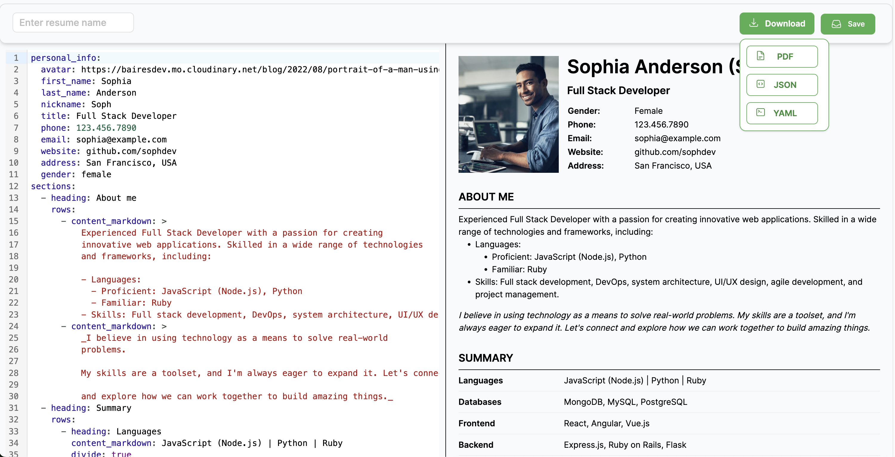

## Resume as code
Write and maintain your resume using YAML/JSON.

Try it here: https://topcv.vercel.app



## YAML Structure

```yaml
personal_info:
  avatar: string!
  first_name: string!
  last_name: string!
  nickname: string
  title: string!
  phone: string
  email: string
  website: string
  address: string
  gender: boolean

sessions: 
  - heading: string!
    rows:
      - heading: string
        content_markdown: string
        divide: boolean
```

## Model Structure
```typescript
export interface ResumeData {
    personal_info: PersonalInfo
    sessions: TableSessionData[]
}

export interface PersonalInfo {
    avatar: string
    first_name: string
    last_name: string
    nickname?: string
    title: string
    gender?: string;
    phone?: string
    email?: string
    website?: string
    address?: string
}

export interface TableSessionData{
    heading: string
    rows: TableSessionRow[]
}

export interface TableSessionRow{
    heading?: string
    content_markdown: string
    content_html?: string,
    divide?: boolean
}

```